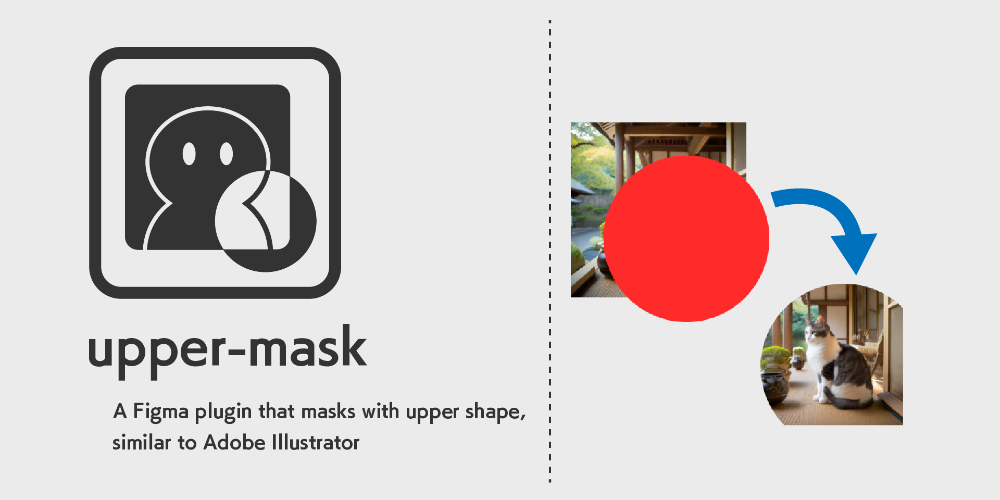

[日本語ドキュメントはこちら]("./docs/README_JP.md)。

# About
This is a plugin that performs clipping masks using shapes placed on top. It behaves similarly to the clipping mask function in Adobe Illustrator.

# How to use
Right-click while selecting multiple objects and shapes that you want to mask.  
Create a mask by selecting Plugins -> upper-mask from the context menu.

When used, a mask group is automatically created. The target shape is moved to the back of the group and becomes a mask mode.